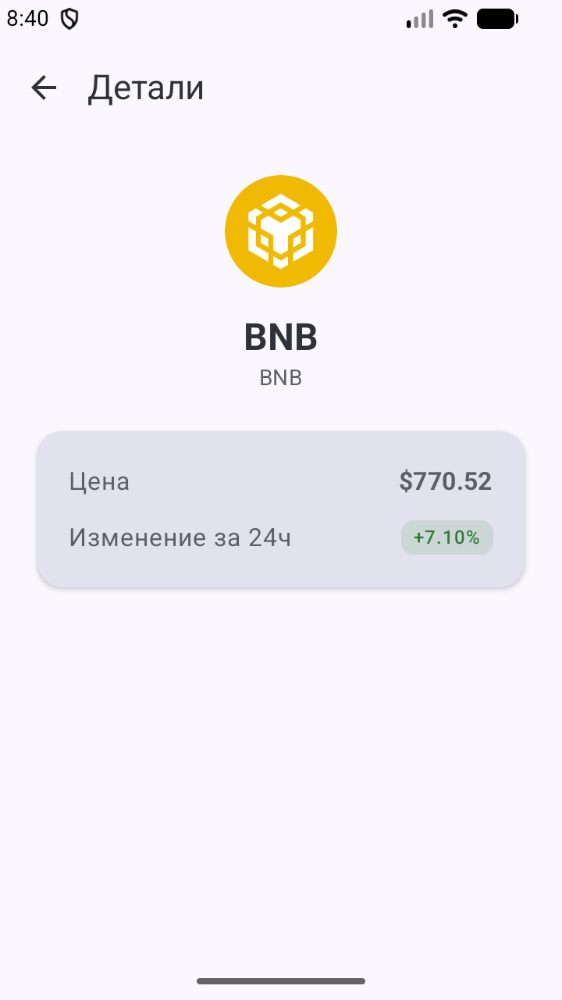

# CryptoTracker

Трекер цен на криптовалюты для Android — список монет с текущей ценой и изменением за 24 часа, переход в детали по тапу. Проект написан, чтобы отработать современную Android-архитектуру целиком: UI на Jetpack Compose, MVVM с чистым разделением на слои data/domain/ui, корутины + Flow и работа с реальным REST API.

## Возможности

- Список криптовалют с актуальной ценой и изменением за 24ч (цветом: зелёный — рост, красный — падение)
- Тап по монете открывает экран деталей
- Состояния загрузки и ошибки с кнопкой **«Повторить»** при сбое
- Данные из публичного API [CoinGecko](https://www.coingecko.com/en/api)

## Скриншоты

&nbsp;&nbsp;

## Стек

| Область | Инструменты |
|---------|-------------|
| Язык | Kotlin |
| UI | Jetpack Compose, Material 3 |
| Архитектура | MVVM, однонаправленный поток данных (UDF) |
| DI | Hilt (Dagger) |
| Асинхронность | Coroutines, Flow, StateFlow |
| Сеть | Retrofit, OkHttp, Gson |
| Изображения | Coil (иконки монет) |
| Навигация | Navigation-Compose |
| Тестирование | JUnit, coroutines-test (fake-репозиторий, MainDispatcherRule) |

## Архитектура

Разделение на три слоя, зависимости направлены внутрь (`ui → domain ← data`):

| Слой | Содержимое | Зависит от |
|------|-----------|-----------|
| **ui** | Compose-экраны, ViewModel, `StateFlow<UiState>` | domain |
| **domain** | модель `Coin` | — |
| **data** | Retrofit `CoinApi`, DTO, маппер, Repository | domain |

`ui` наблюдает состояние и шлёт события во `ViewModel`. `domain` не имеет зависимостей. `data` реализует репозиторий и обращается к **CoinGecko REST API**.

**Поток данных:** UI собирает `StateFlow<UiState>` из ViewModel и отрисовывает его; действия пользователя вызывают методы ViewModel; ViewModel запрашивает Repository, который получает DTO из сети, маппит их в доменные модели и возвращает — ViewModel обновляет состояние, UI перерисовывается.

- **data** — `CoinApi` (интерфейс Retrofit), `CoinDto`, `CoinMappers`, `CoinRepository` + `CoinRepositoryImpl`
- **domain** — `Coin` (чистая модель)
- **ui** — `CoinListScreen` / `CoinListViewModel` / `CoinListUiState`, `CoinDetailScreen`, `MainActivity` (NavHost)
- **di** — Hilt-модули: `NetworkModule` (`@Provides` для Retrofit/`CoinApi`), `CoinRepositoryModule` (`@Binds` интерфейса на реализацию)

**Внедрение зависимостей:** через Hilt. `CoinApi` поставляется модулем, `CoinRepositoryImpl` получает его в конструктор (`@Inject`), а `CoinListViewModel` (`@HiltViewModel`) получает репозиторий — зависимости идут через интерфейсы, что развязывает слои и упрощает тестирование.

## Тестирование

Юнит-тесты выполняются на JVM (устройство не нужно):

- **Тест маппера** — проверяет маппинг DTO → доменную модель по каждому полю
- **Тест ViewModel** — `FakeRepository` внедряется через конструктор + `MainDispatcherRule` для запуска корутин в тестах

## Запуск

1. Клонируй репозиторий и открой в Android Studio.
2. Запусти на эмуляторе или устройстве (min SDK 24).

API публичный, ключ не нужен.
